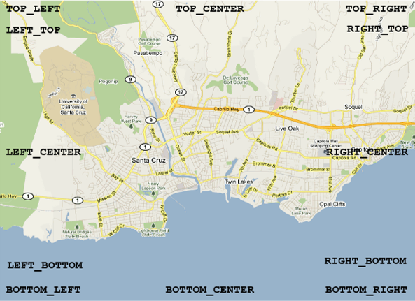
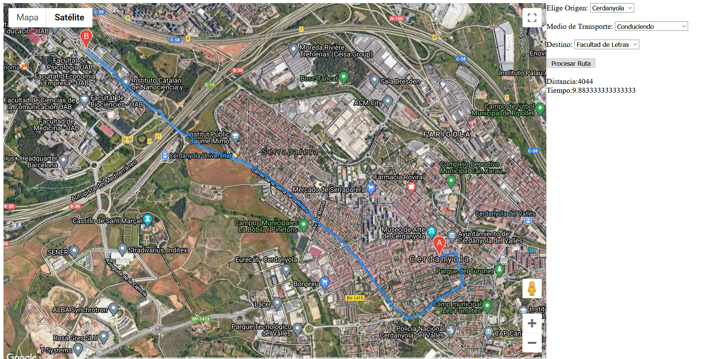

# Librería Google Maps JavaScript API V3

La API de Google Maps forma parte de la Google Maps Platform lo que fácilita la integración con todos los productos disponibles de esta plataforma. 

Es una API que está bien documentada y cuenta con el poder de Google para su desarrollo y mantenimiento. Tiene una muy buena integración con diferentes servicios de Google como lo son el routing, places (para buscar lugares), SDK tanto para iOS como para Android, etc. Todo esto tiene un coste y más ahora que desde el 2018 cambiaron su política de precios y han aumentado mucho los precios.

La referencia de la API la podemos ver en https://developers.google.com/maps/documentation/javascript/reference/?hl=es

!!! warning
    Para obtener una API KEY hay que tener una cuenta de google y introducir un númeor de tarjeta de crédito (aunque no cobren nada durante el período de prueba). Dado que no vamos a introducir ningún número de tarjeta de crédito los ejemplos los veremos directamente de los ejemplos de la documentación de google.

Si tenemos uan API KEY podemos cargar la libreria en nuestro html de la siguiente forma:

``` html
<script>
  (g=>{var h,a,k,p="The Google Maps JavaScript API",c="google",l="importLibrary",q="__ib__",m=document,b=window;b=b[c]||(b[c]={});var d=b.maps||(b.maps={}),r=new Set,e=new URLSearchParams,u=()=>h||(h=new Promise(async(f,n)=>{await (a=m.createElement("script"));e.set("libraries",[...r]+"");for(k in g)e.set(k.replace(/[A-Z]/g,t=>"_"+t[0].toLowerCase()),g[k]);e.set("callback",c+".maps."+q);a.src=`https://maps.${c}apis.com/maps/api/js?`+e;d[q]=f;a.onerror=()=>h=n(Error(p+" could not load."));a.nonce=m.querySelector("script[nonce]")?.nonce||"";m.head.append(a)}));d[l]?console.warn(p+" only loads once. Ignoring:",g):d[l]=(f,...n)=>r.add(f)&&u().then(()=>d[l](f,...n))})({
    key: "YOUR_API_KEY",
    v: "weekly",
    // Use the 'v' parameter to indicate the version to use (weekly, beta, alpha, etc.).
    // Add other bootstrap parameters as needed, using camel case.
  });
</script>
```

Los ejemplos de la API los podemos ver en https://developers.google.com/maps/documentation/javascript/examples?hl=es

## Mi primer mapa

Abriremos el ejemplo de Simple map https://developers.google.com/maps/documentation/javascript/examples/map-simple?hl=es y cambiaremos el Javascript por el siguiente:

``` js
let map;

async function initMap() {
  const { Map } = await google.maps.importLibrary("maps");

	const mapOptions = {
    center: { lat: 42, lng: 2 }, // o new google.maps.LatLng(42,2),
    zoom:9,
    mapTypeId: 'satellite' //o  google.maps.MapTypeId.SATELLITE
  };

  map = new Map(document.getElementById("map"), mapOptions);

}
```

* Center: Posición en coordenadas geográficas
* Zoom: Nivel de zoom. El nivel 0 corresponde a nivel mundial. Alcanza hasta 18 niveles de zoom
* Tipos de mapas:
    * ROADMAP, que muestra los mosaicos normales en 2D predeterminados de Google Maps.
    * SATELLITE muestra imágenes de satélite.
    * HYBRID muestra una mezcla de mosaicos fotográficos y una capa de mosaicos para los elementos del mapa más destacados (carreteras, nombres de ciudades, etc.).
    * TERRAIN muestra mosaicos de relieve físico para indicar las elevaciones del terreno y las fuentes de agua (montañas, ríos, etc.).

## Controles de mapa integrados

El API de Google Maps dispone de varios controles integrados que puedes emplear en tus mapas:

* El **control de zoom** muestra un control deslizante (para mapas grandes) o pequeños botones "+/-" (para mapas pequeños) que permiten controlar el nivel de zoom del mapa. Este control aparece en la esquina superior izquierda del mapa de forma predeterminada en dispositivos no táctiles o en la esquina inferior izquierda del mapa en los dispositivos táctiles.
* El **control de desplazamiento** muestra botones para desplazarse por el mapa. Este control aparece en la esquina superior izquierda del mapa de forma predeterminada en dispositivos no táctiles. El control de desplazamiento también te permite girar imágenes de 45º, si están disponibles.
* El **control de escala** muestra un elemento de escala del mapa. Este control está inhabilitado de forma predeterminada.
* El **control MapType** permite al usuario alternar entre los diferentes tipos de mapas, como ROADMAP (mapa de carreteras) y SATELLITE (satélite). Este control aparece en la esquina superior derecha del mapa de forma predeterminada.
* El **control de Street View** incluye un icono de hombrecito naranja que se puede arrastrar hasta el mapa para habilitar la función de Street View. Este control aparece en la esquina superior izquierda del mapa de forma predeterminada.
* El **control de giro** incluye un icono circular pequeño que te permite girar mapas que contienen imágenes oblicuas. Este control aparece en la esquina superior izquierda del mapa de forma predeterminada (para obtener más información, consulta la documentación sobre imágenes de 45º).
* El **control de mapa general** muestra un mapa general en miniatura que refleja la ventana gráfica del mapa actual dentro de una zona más amplia. Este control aparece en la esquina inferior derecha del mapa y se muestra contraído de forma predeterminada.

No puedes acceder ni modificar estos controles del mapa directamente, pero puedes modificar los campos MapOptions del mapa que afectan a la visibilidad y a la presentación de los controles

``` js
{
    panControl: booleano,
    zoomControl: booleano,
    mapTypeControl: booleano,
    scaleControl: booleano,
    streetViewControl: booleano,
    overviewMapControl: booleano,
    rotateControl:booleano
}
```

### Opciones de los controles

#### Control MapType

El **control MapType** puede mostrarse en una de las siguientes opciones style:

* google.maps.MapTypeControlStyle.HORIZONTAL_BAR muestra el conjunto de controles como botones situados en una barra horizontal como la que se muestra en Google Maps.
* google.maps.MapTypeControlStyle.DROPDOWN_MENU muestra un control de un solo botón que permite seleccionar el tipo de mapa a través de un menú desplegable.
* google.maps.MapTypeControlStyle.DEFAULT muestra el control "predeterminado", que depende del tamaño de la pantalla y puede cambiar en futuras versiones del API.

``` js
mapTypeControlOptions: {
    style: google.maps.MapTypeControlStyle.DROPDOWN_MENU
}
```

### Cómo colocar los controles



Ejemplo: https://developers.google.com/maps/documentation/javascript/examples/control-positioning?hl=es


## Superposiciones

Google Maps API incorpora varios tipos de superposiciones

### Marcadores

Los puntos en el mapa se muestran mediante marcadores. En algunas ocasiones, los marcadores pueden mostrar imágenes de iconos personalizados, que se denominan normalmente "iconos". Los marcadores e iconos son objetos de tipo Marker.

``` js
const { AdvancedMarkerElement } = await google.maps.importLibrary("marker");

const myLatLng = { lat: 42, lng: 2};
const marker = new AdvancedMarkerElement({
    position: myLatlng,
    map:map,
    title:"Hello World!"
});
```

Ejemplo: https://developers.google.com/maps/documentation/javascript/examples/advanced-markers-simple?hl=es

#### Marcadores personalizados

``` js
const { AdvancedMarkerElement } = await google.maps.importLibrary("marker");

// A marker with a with a URL pointing to a PNG.
const customImg = document.createElement("img");

customImg.src = 'http://betaserver.icgc.cat/mapicons/aed-2.png'

new AdvancedMarkerElement({
    position: map.getCenter(),
    content: customImg,
    map,
  });
```

Ejemplo: https://developers.google.com/maps/documentation/javascript/examples/advanced-markers-basic-style?hl=es

Podéis encontrar más íconos de ejemplo en http://betaserver.icgc.cat/mapicons/ o en https://betaserver2.icgc.cat/maki/pin-l-f+ceff00@2x.png

### Líneas

Las líneas sobre el mapa se muestran mediante polilíneas, que representan una serie ordenada de ubicaciones. Las líneas son objetos de tipo Polyline.

Ejemplo: https://developers.google.com/maps/documentation/javascript/examples/polyline-simple?hl=es

### Polígonos

Las áreas del mapa con forma irregular se muestran mediante polígonos, que son similares a las polilíneas. Al igual que las polilíneas, los polígonos representan una serie ordenada de ubicaciones; la diferencia estriba en que los polígonos definen la región que engloban.

Ejemplo: https://developers.google.com/maps/documentation/javascript/examples/polygon-hole?hl=es

Podéis ver la documentación tanto de líneas como de polígonos en https://developers.google.com/maps/documentation/javascript/reference/polygon?hl=es

### Ventana de información

La **ventana de información** es también un tipo de superposición especial para la visualización de contenido (normalmente texto o imágenes) en un globo emergente que se muestra sobre el mapa en una ubicación determinada.

Ejemplo: https://developers.google.com/maps/documentation/javascript/examples/infowindow-simple?hl=es


### Superposiciones personalizadas

Si quieres, también puedes implementar **superposiciones personalizadas**. Estas superposiciones personalizadas implementan la interfaz OverlayView.

Ejemplo: https://developers.google.com/maps/documentation/javascript/examples/overlay-simple?hl=es

### GeoJSON

Podemos agregar un geojson desde una URL que lo contenga o desde una variable que contenga el GeoJSON 

Ejemplo: https://developers.google.com/maps/documentation/javascript/examples/layer-data-style?hl=es

``` js
const gasolineras = {
    "type": "FeatureCollection",
    "crs": { "type": "name", "properties": { "name": "urn:ogc:def:crs:OGC:1.3:CRS84" } },
    "features": [
        { "type": "Feature", 
            "properties": { 
                "lon": -16.484670, 
                "lat": 28.428720, 
                "Nombre": "REPSOL Horario Especial 0"}, 
                "geometry": { "type": "Point", "coordinates": [ -16.48467, 28.42872 ] } 
        },
        { "type": "Feature", 
        "properties": { 
            "lon": -16.460470, 
            "lat": 28.449530, 
            "Nombre": "DISA EL BOHIO L-D: 24H 0"}, 
            "geometry": { "type": "Point", "coordinates": [ -16.46047, 28.44953 ] } 
        } 
    ]
};
map.data.addGeoJson(gasolineras);
```

### KML

Ejemplo: https://developers.google.com/maps/documentation/javascript/examples/layer-kml?hl=es


## Street View

Son vistas panorámicas de 360 grados de las principales rutas del mundo.

Se puede utilizar directamente como control en el mapa:
MapOptions: streetViewControl: true o false.

Ejemplo: https://developers.google.com/maps/documentation/javascript/examples/streetview-simple?hl=es

``` js
const uab = { lat: 41.503317, lng: 2.107957 };
  const map = new google.maps.Map(document.getElementById("map"), {
    center: uab,
    zoom: 14,
  });
  const panorama = new google.maps.StreetViewPanorama(
    document.getElementById("pano"),
    {
      position: uab,
      pov: {
        heading: 270,
        pitch: 10
      },
    }
  );
  map.setStreetView(panorama);
```

## Routing

Google dispone de un servicio de cálculo de rutas denominado DirectionsService.
También dispone de un servicio de visualización de rutas denominado DirectionsRenderer.

La petición de una ruta requiere de los siguientes parámetros.
``` js
{
  origin: LatLng | String | google.maps.Place,
  destination: LatLng | String | google.maps.Place,
  travelMode: TravelMode,
  transitOptions: TransitOptions,
  drivingOptions: DrivingOptions,
  unitSystem: UnitSystem,
  waypoints[]: DirectionsWaypoint,
  optimizeWaypoints: Boolean,
  provideRouteAlternatives: Boolean,
  avoidHighways: Boolean,
  avoidTolls: Boolean,
  region: String
}
```

* origin: Origen de la ruta en (LatLng | String | google.maps.Place)
* destination: Destino de la ruta en (LatLng | String | google.maps.Place)
* travelMode: Modo de viaje 
	* DRIVING: Opción por defecto (Coche)
	* TRANSIT: Transporte público
	* BICYCLING: Bicicleta
	* WALKING: Caminando
* transitOptions: {
  arrivalTime: Fecha,
  departureTime: Fecha,
  modes[]: (BUS,RAIL,SUBWAY,TRAIN,TRAM)
  routingPreference: (FEWER_TRANSFERS, LESS_WALKING)
}
* drivingOptions:{
  departureTime: Fecha,
  trafficModel: (BEST_GUESS, OPTIMISTIC, PESSIMISTIC)
},
* unitSystem: Unidadaes,
* waypoints[]: Puntos intermedios,
* optimizeWaypoints: Optimizar puntos intermedios (booleano),
* provideRouteAlternatives: Mostrar rutes alternatives (booleano),
* avoidHighways: Evitar autopistes (booleano),
* avoidTolls: Evitar peajes (booleano),
* region: Región donde se calcula la ruta

Ejemplo: https://developers.google.com/maps/documentation/javascript/examples/directions-simple?hl=es

## Ejemplos

Podéis ver más ejemplos de código en https://developers.google.com/maps/documentation/javascript/examples/

### Ejercicio entregable

!!! question "Ejercicio 2 pts"
    1. Crear un mapa con la API de google maps. Iniciar el mapa centrado en Catalunya **(0.5 pt)**
    2. El mapa debe tener el fondo Hibrido activado por defecto **(0.5 pt)**
    3. Agregar un formulario para crear una ruta. **(0.5 pt)**
      * Las ciudades de origen deben ser: Barcelona, Terrassa, Sabadell, Cerdanyola y Manresa.
      Los destino deben ser: Facultad de Letras de la UAB y el Parque del Tibidabo
      * Los medios de transporte debes ser: Conduciendo, Caminando, Bicicleta, Transporte público.
      * Botón para calcular la ruta.
    4. Mostrar la distancia de la ruta (en Km) y el tiempo de recorrido (en la unidad más adecuada, minutos u horas) **(0.5 pt)**


Ejemplo ejercicio

## Referencias

https://developers.google.com/maps/documentation/javascript/reference/?hl=es
